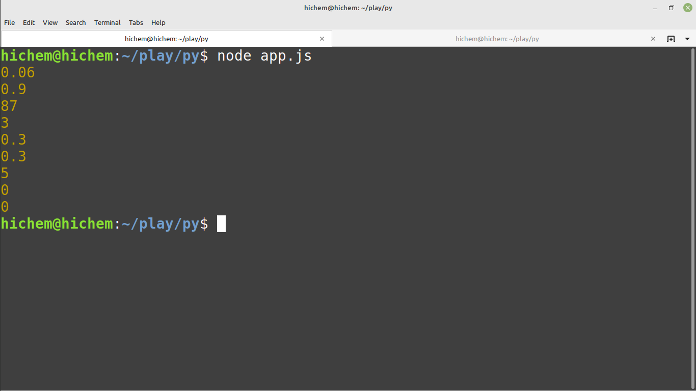
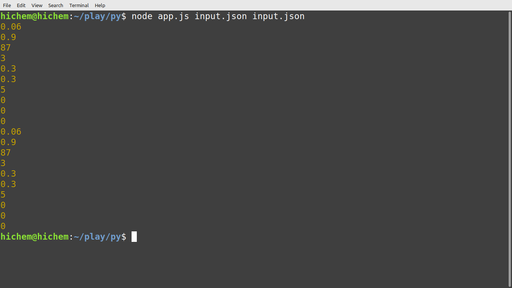
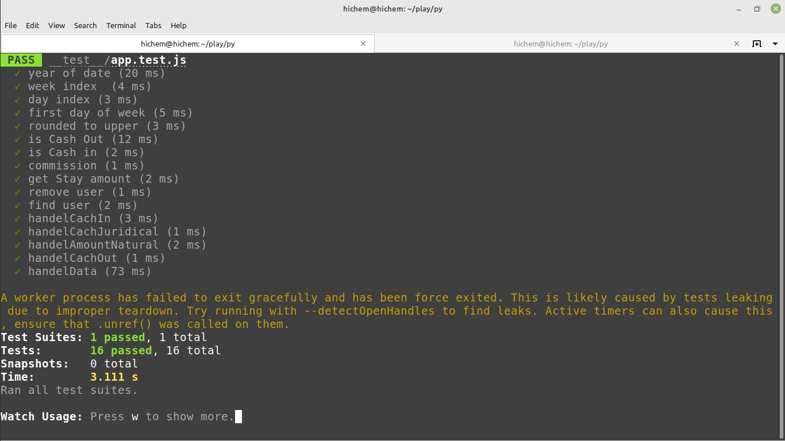

# hwo run me
- git clone https://github.com/hichemdz/lk_task.git
- run npm install or yarn add package.json
- Open the terminal or cmd and change the path to the Lk_task folder and  write 
> ``` node app.js nameFile.json```




you can run multi files  

> ``` node app.js n1.json n2.json ...```



# how test me
- run yarn test or npm test 
- you can find test file  in folder py/\__test__


## display function

- rounded : rounded commission to to upper bound
  > ``` rounded(commistion:decimal):decimal```
  >``` rounded(0.023):decimal => 0.024```
- getDayIndex: get index for day, the first day is 0
 
  >``` getDayIndex(date:date):number```
  >```getDayIndex('2016-01-12') => 0 ```

- getWeekIndex: get week index of date , the first week is 0
  >``` getWeekIndex(date:date):number```
  >```getWeekIndex('2016-01-12'()=>3```
- getYear: get year of date
  >``` getYear(date:date):number=>year```
  >```getYear('2016-01-12')=>2016```
- checkDaysInSameWeek: check if the days in the same week
  >``` checkDaysInSameWeek(d1:date,d2:date):Boolean```
  >```checkDaysInSameWeek('2016-01-12','2016-01-11')=>true```
- isFirstweekday: Check if the day is the first day of the week
  >``` isFirstweekday(d1:date):Boolean```
  >```isFirstweekday('2016-01-12')=>false```
- isCashOut: Check if the method type is cashout
  >```isCashOut(type:string):Boolean```
  >```isCashOut('cash_out')=>true```
- isCashOutNatural Check if the user type is natural
  >```isCashOutNatural(user_type:string):Boolean```
  >```isCashOutNatural('natural')=>true```
- fetchData: get data from api
  >```fetchData(url:string):Object```
  >```fetchData('https://developers...')=>Object```
- calcCommission: Commission calculator with rounded
  >```calcCommission(amount:decimal):decimal```
  >```calcCommission(30000) => 0.6```
- findUser: find the user in the data array of cash out natural users  
  >```findUser(CashOutNaturalUsers:Array, user_id:int):Object```
  >```findUser([], 1)=>{}```
- removeUser: remove the user in the data array of cash out natural users  
  >```removeUser(CashOutNaturalUsers:Array, user_id:int):Object```
  >```removeUser([], 1)=>{}``` 
- handelCachIn: container of function handle cash-in
  >```handelCachIn = (role:object, currency:string, amount:Decimal):Decimal ```
  >```handelCachIn = (CashOutNaturalUsers, 'eur', 30000)=> 0.3 ```
- handelAmountNatural: container of function handle  cash-out Natural
  >``` handelAmountNatural(CashOutNaturalUsers:Array,date:Date,user_id:Int ,amountweek_limit:Object,percents:Decimal):Decimal```
- handelCachJuridical:container of function handle cash-out Juridical
  >``` handelCachJuridical(currency:String, amount:Decimal, percents, min):Decimal```
- handelCachOut: handle with cash-out 
  >``` handelCachJuridical(role:Object,date:Date,user_type:String,amount:Decimal,user_id:Int,currency:String,CashOutNaturalUsers:Array):Decimal```
- handelData: container of all function and print result 
  >``` handelData(data:Array):promece ```
- handelNodeCommand: handel arges of command line and run handelData
